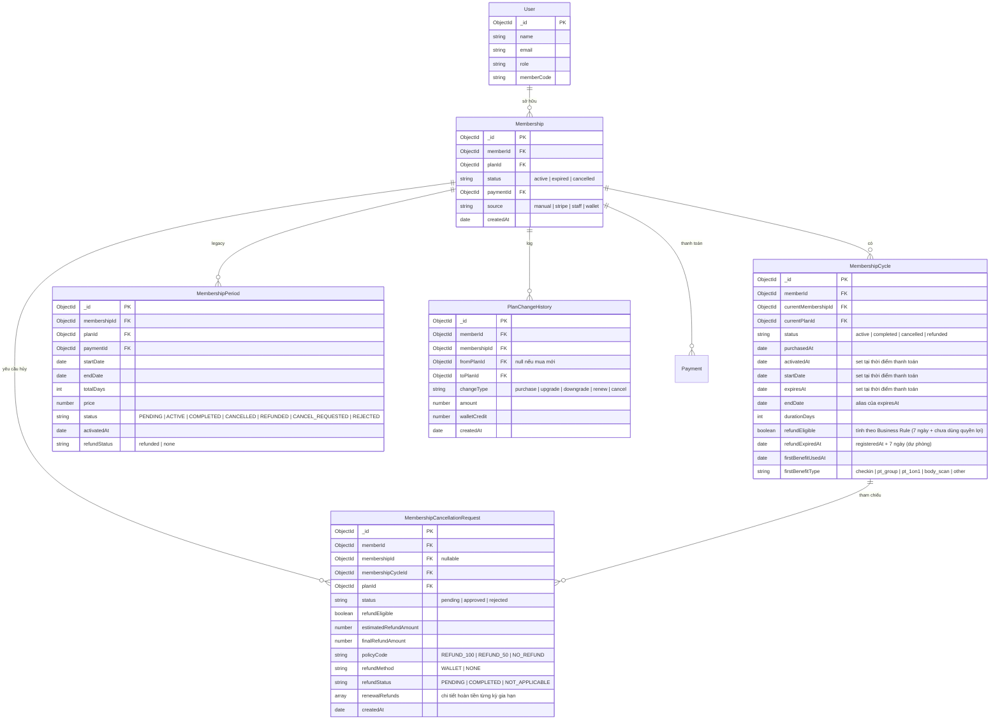
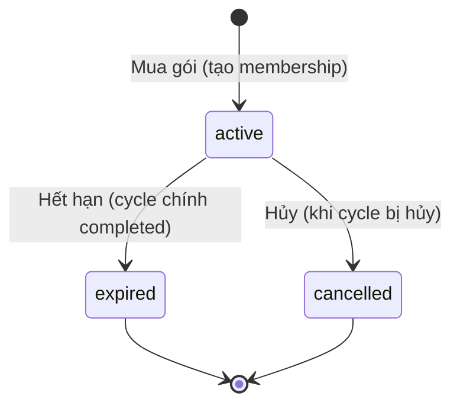
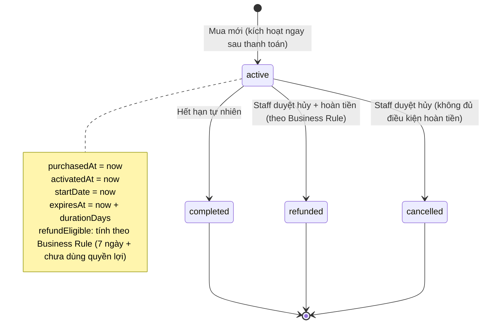
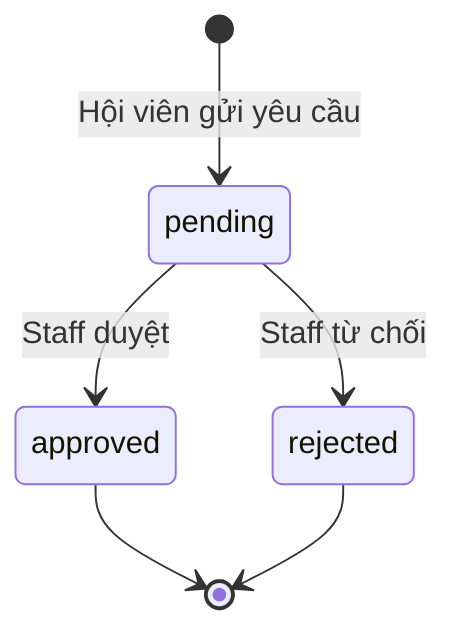
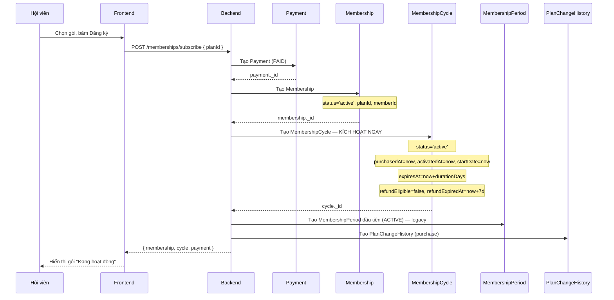
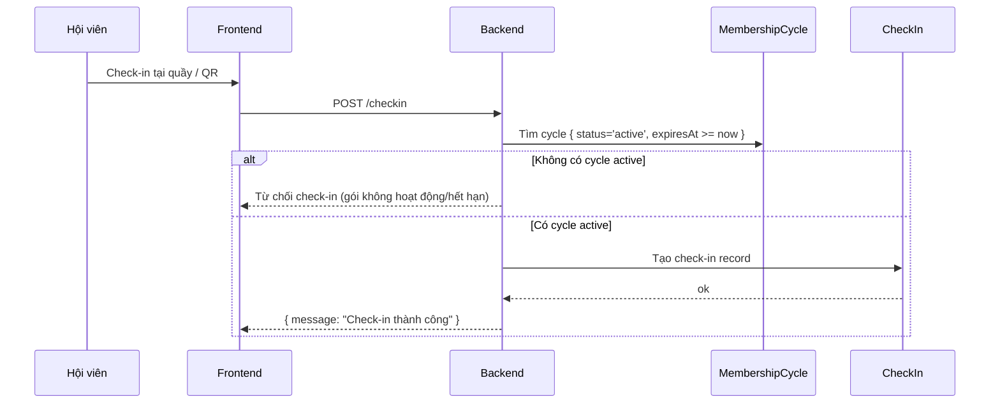
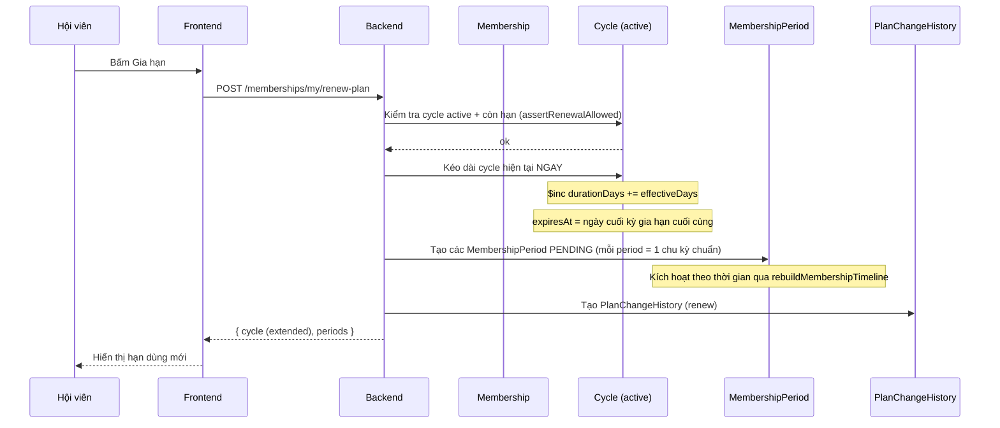
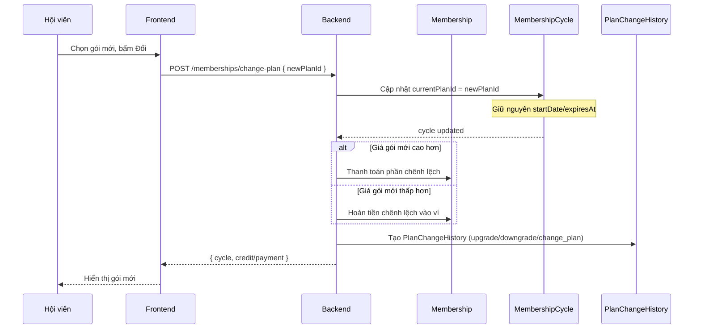
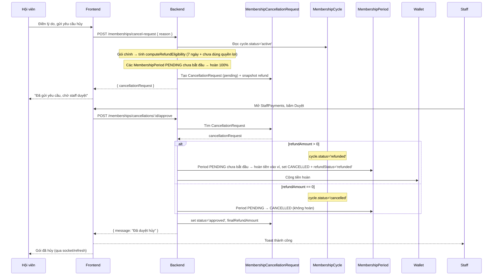

# Membership System Architecture

> **Implemented** — Tài liệu này mô tả kiến trúc **hiện tại** của hệ thống.
> Kể từ refactor, **gói tập được kích hoạt NGAY khi thanh toán thành công**, không còn trạng thái "chờ kích hoạt", không cần check-in để kích hoạt, và không còn cron job kích hoạt kỳ gia hạn.

---

## 1. Mục tiêu hệ thống

### Các model chính

| Model | Vai trò |
|-------|---------|
| **Membership** | **Container** — xác định hội viên đang sở hữu gì. Chỉ lưu memberId, planId, payment và trạng thái tổng quát (`active` / `expired` / `cancelled`). **Không lưu thời gian.** |
| **MembershipCycle** | **Nguồn sự thật duy nhất** — quyết định gói đang ở trạng thái nào, thời gian nào. **Luôn tạo với `status='active'` ngay khi thanh toán.** Một Membership có thể có nhiều Cycle (khi hết hạn rồi đăng ký lại). |
| **MembershipPeriod** | **Legacy** — vẫn được tạo song song để theo dõi từng chu kỳ (period) của gói, phục vụ hiển thị và tính hoàn tiền cho các kỳ gia hạn chưa bắt đầu. |
| **MembershipCancellationRequest** | Lưu yêu cầu hủy của hội viên. Khi staff duyệt, ảnh hưởng đến MembershipCycle (set status = refunded/cancelled) và các MembershipPeriod PENDING. |
| **PlanChangeHistory** | Ghi log mỗi lần hội viên thay đổi gói (mua mới, gia hạn, nâng cấp, hạ cấp, hủy). Chỉ đọc, không ảnh hưởng đến logic. |

### Quan hệ giữa các model

```
Member (User)
  │
  ├── 1 ── N ──► Membership          (một member có thể có nhiều membership theo thời gian)
  │                │
  │                ├── 1 ── N ──► MembershipCycle    (nhiều cycle khi đăng ký lại sau khi hết hạn)
  │                │
  │                ├── 1 ── N ──► MembershipPeriod   (legacy — nhiều period khi gia hạn)
  │                │
  │                ├── 1 ── N ──► PlanChangeHistory  (log thay đổi)
  │                │
  │                └── 1 ── N ──► MembershipCancellationRequest (yêu cầu hủy)
  │
  ├── 1 ── N ──► Payment            (thanh toán)
  │
  └── 1 ── N ──► MembershipRenewal  (log mỗi lần gia hạn)
```

### Nguyên tắc thiết kế

1. **Một Membership = một lần đăng ký.** Nếu member hết hạn rồi đăng ký lại, tạo Membership mới.
2. **Gói kích hoạt ngay sau thanh toán.** Cycle được tạo với `status='active'`, `activatedAt=startDate=thời điểm thanh toán`.
3. **Check-in KHÔNG kích hoạt gói.** Check-in chỉ ghi nhận lượt vào và kiểm tra cycle đang `active` còn hạn.
4. **Gia hạn kéo dài cycle hiện tại.** Không tạo cycle mới, không có trạng thái pending.
5. **Membership không lưu startDate, endDate, activatedAt.** Các thông tin này chỉ có ở Cycle.
6. **Hoàn tiền theo Business Rule:** chỉ hoàn 100% khi còn trong vòng 7 ngày kể từ ngày đăng ký VÀ chưa sử dụng bất kỳ quyền lợi nào của gói (check-in, đặt lịch PT, tham gia lớp học, dùng tính năng yêu cầu quyền của gói). Gói chính được tính theo rule này; các kỳ gia hạn chưa bắt đầu vẫn được hoàn.

---

## 2. Entity Relationship Diagram (ERD)



---

## 3. State Machine

### Membership (Container)



### MembershipCycle



> Không còn trạng thái `pending_initial_activation` / `pending_renewal_activation`.
> Gia hạn **không** tạo cycle mới — chỉ `$inc durationDays` và kéo dài `expiresAt` của cycle active.

### MembershipCancellationRequest



---

## 4. Sequence Diagram

### A. Mua gói (thanh toán wallet)



### B. Check-in



> Check-in **không** kích hoạt gói, **không** thay đổi cycle. Cycle đã active từ lúc thanh toán.

### C. Gia hạn (khi đang active)



> Không tạo cycle pending. Kỳ gia hạn tương lai nằm dưới dạng `MembershipPeriod.status='PENDING'`
> và được bật tự động khi kỳ trước hết hạn (qua `rebuildMembershipTimeline`) — **không có cron job riêng**.

### D. Đổi gói (khi đang active)



### E. Hủy gói (Hội viên gửi yêu cầu + Staff duyệt)



---

## 5. Single Source of Truth

Bảng dưới đây xác định **MỘT nơi duy nhất** cho mỗi thông tin.

### MembershipCycle — SỞ HỮU

| Thông tin | Model sở hữu | Nơi được phép sửa |
|-----------|-------------|-------------------|
| `startDate` | **MembershipCycle** | `membershipService.subscribeWithWallet` (khi tạo), `memberController` (khi staff tạo) |
| `expiresAt` / `endDate` | **MembershipCycle** | `membershipService.subscribeWithWallet` (tạo / gia hạn), `memberController` (khi staff tạo) |
| `activatedAt` | **MembershipCycle** | `membershipService.subscribeWithWallet`, `memberController` (set = thời điểm thanh toán) |
| `purchasedAt` | **MembershipCycle** | `membershipService.subscribeWithWallet`, `memberController` |
| `durationDays` | **MembershipCycle** | `membershipService.subscribeWithWallet` (tạo / gia hạn `$inc`) |
| `status` | **MembershipCycle** | `membershipService.subscribeWithWallet` (tạo `active`), `cancellationController` (khi duyệt → refunded/cancelled), `refundRequestService` |
| `currentMembershipId` | **MembershipCycle** | `membershipService`, `memberController` |
| `currentPlanId` | **MembershipCycle** | `membershipService`, `planChangeController`, `memberController` |
| `refundEligible` | **MembershipCycle** | `membershipService.computeRefundEligibility` (tính theo Business Rule), `cancellationController` (check) |

### Membership — CHỈ CONTAINER

| Thông tin | Model sở hữu | Controller được phép sửa |
|-----------|-------------|---------------------------|
| `memberId` | **Membership** | `membershipService` (khi tạo) |
| `planId` | **Membership** | `membershipService`, `planChangeController` |
| `paymentId` | **Membership** | `membershipService`, `memberController` |
| `source` | **Membership** | `membershipService`, `memberController` |
| `status` | **Membership** | `membershipService` (khi tạo), `membershipService.rebuildMembershipTimeline` |
| `createdAt` | **Membership** | Tự động (mongoose timestamp) |

> ⚠️ **Membership KHÔNG lưu:** `startDate`, `endDate`, `activatedAt`, `cancelledAt`, `cancelReason`.
> Các thông tin này chỉ có ở MembershipCycle.

### MembershipPeriod — LEGACY (hoàn tiền kỳ gia hạn)

| Thông tin | Model sở hữu | Controller được phép sửa |
|-----------|-------------|---------------------------|
| `status` | **MembershipPeriod** | `membershipService` (tạo), `membershipService.rebuildMembershipTimeline`, `cancellationController` (khi duyệt hủy) |
| `refundStatus` / `refundAmount` / `refundAt` / `refundMethod` | **MembershipPeriod** | `cancellationController` (khi duyệt hủy) |

### MembershipCancellationRequest

| Thông tin | Model sở hữu | Controller được phép sửa |
|-----------|-------------|---------------------------|
| `status` | **MembershipCancellationRequest** | `cancellationController` (set approved/rejected) |
| `refundEligible` | **MembershipCancellationRequest** | `cancellationController.createCancellationRequest` (snapshot) |
| `estimatedRefundAmount` | **MembershipCancellationRequest** | `cancellationController.createCancellationRequest` |
| `finalRefundAmount` | **MembershipCancellationRequest** | `cancellationController.approveCancellationRequest` |
| `renewalRefunds` | **MembershipCancellationRequest** | `cancellationController.createCancellationRequest` |

---

## 6. Controller Responsibility

### Backend Controllers / Services

| Controller/Service | Đọc model nào | Ghi model nào | Ghi chú |
|---|---|---|---|
| **membershipService** | Membership ✅, MembershipCycle ✅, MembershipPeriod ✅, Plan ✅, Payment ✅, Wallet ✅, Transaction ✅ | Membership ✅, MembershipCycle ✅, MembershipPeriod ✅, Payment ✅, PlanChangeHistory ✅, Wallet ✅, Transaction ✅, MembershipRenewal ✅ | Lõi — mua (kích hoạt ngay), gia hạn (kéo dài cycle), getMyMembership, rebuildMembershipTimeline |
| **membershipController** | MembershipCycle ✅, MembershipPeriod ✅ | ❌ | GET periods, GET cycles (admin) |
| **cancellationController** | Membership ✅, MembershipCycle ✅, MembershipPeriod ✅, MembershipCancellationRequest ✅ | MembershipCycle ✅, MembershipPeriod ✅, MembershipCancellationRequest ✅, Wallet ✅, Transaction ✅, PTAssignment ✅, ClassEnrollment ✅ | Hủy gói + hoàn tiền kỳ gia hạn |
| **refundRequestService** | MembershipPeriod ✅, Membership ✅, RefundRequest ✅, MembershipCycle ✅ | MembershipPeriod ✅, Membership ✅, RefundRequest ✅, MembershipCycle ✅, Wallet ✅, Transaction ✅ | Period-based (legacy) |
| **planChangeController** | Membership ✅, MembershipCycle ✅, Plan ✅ | Membership ✅, MembershipCycle ✅, PlanChangeHistory ✅ | Đổi gói (không extend thời gian) |
| **dailyQRCodeController** | MembershipCycle ✅ | MembershipCycle ✅ (đọc active), CheckIn ✅ | Kiểm tra cycle active khi check-in QR |
| **checkInController** | MembershipCycle ✅, Membership ✅ | CheckIn ✅ | Staff check-in — kiểm tra cycle active |
| **bookingController** | MembershipCycle ✅ | ❌ | Kiểm tra cycle active + expiresAt >= ngày đặt |
| **planController** | Membership ✅ (countDocuments) | ❌ | Thống kê |
| **memberController** | Membership ✅, MembershipCycle ✅ | Membership ✅, MembershipCycle ✅ | Staff tạo member / membership → tạo cycle active ngay |
| **authController** | Membership ✅ | ❌ | Kiểm tra membership khi login |
| **featureCheck** | MembershipCycle ✅, Membership ✅ | ❌ | Kiểm tra plan features |
| **ptAssignmentService / trainingRequestService** | MembershipCycle ✅ | ❌ | Lấy plan từ cycle active |
| **config/startupTasks** | MembershipCycle ✅ | MembershipCycle ✅ (housekeeping khi khởi động) | Thay thế cron job kích hoạt cũ |

> ❌ **Đã xoá:** `membershipCycleService.js`, `jobs/activateRenewalCyclesJob.js`, `jobs/refundReminderJob.js`.
> Không còn cron kích hoạt kỳ gia hạn.

### Frontend Pages / Components

| Page | Đọc model nào | Ghi chú |
|------|-------------|---------|
| **MyMembershipPage** | MembershipCycle (status, startDate, expiresAt, durationDays) ✅ | Hiển thị theo `displayStatus`; không còn trạng thái chờ kích hoạt |
| **CancelMembershipPage** | CancelInfo (bao gồm cycle data + renewal refund) ✅ | Hiển thị "Quyền hoàn tiền" theo Business Rule (7 ngày + chưa dùng quyền lợi); kỳ gia hạn chưa bắt đầu được hoàn |
| **StaffPaymentsPage** | CancellationRequest + RefundRequest (merged) ✅ | Nhãn trạng thái đã bỏ "Chờ kích hoạt" |
| **StaffPlanCounterPage** | Plan ✅ | Nút "Đăng ký gói" thay vì "Kích hoạt gói" |
| **StaffCheckinPage** | MembershipCycle ✅ | Hiển thị "Hạn dùng" + trạng thái active/expired |
| **PTClientsPage** | MembershipCycle ✅ | `membershipStatus: 'active' \| 'expired' \| null` |
| **BookingPage / WorkoutPage** | MembershipCycle ✅ | Chỉ cho dùng khi cycle active còn hạn |
| **AdminMembersPage** | MembershipCycle ✅ | Nhãn "Đang hoạt động" / "Đã hết hạn" |

---

## 7. Business Rules

### 7.1. Mua mới

| Rule | Mô tả |
|------|-------|
| **R1** | Khi thanh toán thành công, tạo Membership (`status='active'`) và MembershipCycle với **`status='active'` NGAY**. |
| **R2** | Cycle mới: `purchasedAt=now`, `activatedAt=now`, `startDate=now`, `expiresAt=now+durationDays`, `refundEligible=false`, `refundExpiredAt=now+7 ngày`, `previousCycleId=null`. |
| **R3** | Hoàn tiền gói chính theo **Business Rule**: đủ điều kiện khi còn trong **7 ngày kể từ ngày đăng ký** VÀ **chưa sử dụng bất kỳ quyền lợi nào** của gói. Được tính lại mỗi lần xem qua `computeRefundEligibility`. |
| **R4** | Membership container KHÔNG lưu startDate/endDate/activatedAt. |
| **R5** | Nếu member đã có cycle `active`, không cho đăng ký gói mới (bắt buộc gia hạn). |

### 7.2. Check-in / Sử dụng

| Rule | Mô tả |
|------|-------|
| **R6** | Check-in **KHÔNG** kích hoạt gói. Chỉ kiểm tra cycle `status='active'` và `expiresAt >= now`. |
| **R7** | Các benefit khác (PT, body scan, đặt lịch) cũng không kích hoạt gì — chỉ cần cycle active. |

### 7.3. Gia hạn

| Rule | Mô tả |
|------|-------|
| **R8** | Gia hạn yêu cầu có cycle active đang còn hạn (`assertRenewalAllowed`). |
| **R9** | Gia hạn **kéo dài cycle hiện tại ngay lập tức**: `$inc durationDays += effectiveDays`, `expiresAt = ngày cuối kỳ gia hạn cuối cùng`. **Không tạo cycle mới.** |
| **R10** | Tạo các `MembershipPeriod.status='PENDING'` cho từng kỳ tương lai (legacy). Các kỳ này được bật thành `ACTIVE` theo thời gian qua `rebuildMembershipTimeline` khi kỳ trước hết hạn — **không có cron job riêng**. |
| **R11** | Tạo `MembershipRenewal` (log) và `PlanChangeHistory` (renew). |

### 7.4. Hoàn tiền

| Rule | Mô tả |
|------|-------|
| **R12** | Hoàn tiền gói chính: đủ điều kiện khi còn trong **7 ngày** kể từ ngày đăng ký (`registeredAt = purchasedAt || startDate || createdAt`) VÀ **chưa sử dụng bất kỳ quyền lợi nào** (check-in ≥ 1, đặt lịch PT, tham gia lớp học, hoặc dùng tính năng yêu cầu quyền của gói). Hoàn **100%** planPrice. |
| **R13** | Kỳ gia hạn (`MembershipPeriod.status='PENDING'`) **chưa bắt đầu** (`now < startDate`) → hoàn 100% giá period khi hủy. |
| **R14** | Kỳ gia hạn **đã bắt đầu** → không hoàn. |
| **R15** | Quyền hoàn tiền + `estimatedRefundAmount` được snapshot tại thời điểm tạo CancellationRequest, không thay đổi sau đó. |
| **R16** | `estimatedRefundAmount = (gói chính nếu đủ điều kiện) + tổng tiền các kỳ gia hạn chưa bắt đầu`. `refundEligible = estimatedRefundAmount > 0`. |

### 7.4.1. Tính điều kiện hoàn tiền gói chính (`computeRefundEligibility`)

| Kết quả | Điều kiện | Phản hồi cho hội viên |
|---------|-----------|----------------------|
| `eligible = true` | `within7Days = true` VÀ `hasUsedBenefit = false` | 🟢 Có thể hoàn tiền — hoàn 100% |
| `eligible = false` | `hasUsedBenefit = true` hoặc `within7Days = false` | 🔒 Không áp dụng — đã sử dụng quyền lợi của gói hoặc đã quá 7 ngày kể từ ngày đăng ký |

Trả về: `{ eligible, hasUsedBenefit, within7Days, registeredAt, refundDeadline, remainingDays, reason }`.

### 7.5. Đổi gói

| Rule | Mô tả |
|------|-------|
| **R17** | Khi đổi gói, chỉ cập nhật `currentPlanId` trên cycle hiện tại. |
| **R18** | Thời gian startDate/expiresAt không thay đổi. |
| **R19** | Nếu gói mới giá cao hơn: thu phần chênh lệch. Nếu thấp hơn: hoàn chênh lệch vào ví. |

### 7.6. Hủy gói

| Rule | Mô tả |
|------|-------|
| **R20** | Hội viên gửi yêu cầu hủy cycle đang `active`. Mỗi cycle có một CancellationRequest riêng. |
| **R21** | Staff duyệt: `cycle.status='refunded'` nếu `refundAmount > 0`, ngược lại `'cancelled'`. |
| **R22** | Các `MembershipPeriod` PENDING chưa bắt đầu → `CANCELLED` + hoàn tiền vào ví (`refundStatus='refunded'`). |
| **R23** | Các `MembershipPeriod` PENDING đã bắt đầu → `CANCELLED` (không hoàn, `refundStatus='none'`). |
| **R24** | Staff từ chối → cycle/period giữ nguyên. |

### 7.7. Hiển thị Frontend

| Rule | Mô tả |
|------|-------|
| **R25** | `displayStatus` được tính từ cycle: `active` \| `expiring_soon` \| `expires_today` \| `expired` \| `cancelled` \| `refunded`. |
| **R26** | `active`/`expiring_soon`/`expires_today` → badge "Đang hoạt động". |
| **R27** | `expired` → badge "Đã hết hạn". |
| **R28** | `cancelled` → badge "Đã hủy". |
| **R29** | `refunded` → badge "Đã hoàn tiền". |
| **R30** | Info: "Ngày bắt đầu" = startDate, "Ngày hết hạn" = expiresAt, "Số ngày còn lại" = remainingDays. |
| **R31** | Gia hạn sắp tới (kỳ PENDING chưa bắt đầu) → nhãn "Sắp bắt đầu", không còn "Chờ kích hoạt". |

---

## 8. Edge Cases

| # | Tình huống | Xử lý |
|---|-----------|--------|
| **EC1** | Mua gói → quá 7 ngày | Cycle vẫn `active` (đã kích hoạt ngay). Không ảnh hưởng gì tới thời gian. |
| **EC2** | Gia hạn khi gói đang chạy | Kéo dài `durationDays` + `expiresAt` của cycle hiện tại. Tạo period PENDING. |
| **EC3** | Đổi gói → rồi hủy | Hủy cycle hiện tại. PlanChangeHistory ghi log đổi gói rồi log hủy. |
| **EC4** | Hủy gói chính | Tính `computeRefundEligibility`: hoàn 100% nếu còn trong 7 ngày từ ngày đăng ký VÀ chưa dùng quyền lợi nào; ngược lại không hoàn. Các period gia hạn PENDING chưa bắt đầu vẫn được hoàn. |
| **EC5** | Staff từ chối yêu cầu hủy | Cycle giữ nguyên trạng thái. Membership giữ nguyên. |
| **EC6** | Thanh toán lỗi (mua gói) | Không tạo Membership, không tạo Cycle. Payment status = FAILED. |
| **EC7** | Thanh toán lỗi (gia hạn) | Không extend cycle, không tạo period. Payment status = FAILED. Cycle cũ vẫn active. |
| **EC8** | Check-in khi gói hết hạn | Không có cycle active → từ chối check-in. |
| **EC9** | Gia hạn nhiều lần | Mỗi lần tạo thêm period PENDING và kéo dài expiresAt thêm tương ứng. Không tạo cycle mới. |
| **EC10** | Gia hạn khi cycle active đã hết hạn (còn period PENDING) | Period PENDING được bật thành ACTIVE qua `rebuildMembershipTimeline`; member có thể gia hạn tiếp từ đó. |
| **EC11** | Member có 2 Memberships (hết hạn rồi mua lại) | Mỗi Membership độc lập. Chỉ cycle active được dùng. Cycles cũ đều completed. |
| **EC12** | Staff tạo membership (offline) | Tạo Membership + Cycle `status='active'` ngay (startDate/activatedAt = thời điểm staff tạo). Không cần check-in để kích hoạt. |

---

## 9. File Impact (trạng thái hiện tại)

### Model
| File | Ghi chú |
|------|---------|
| `gym-backend/src/models/MembershipCycle.js` | Enum status: `['active', 'completed', 'cancelled', 'refunded']`. Bỏ mọi trạng thái pending. |
| `gym-backend/src/models/Membership.js` | Enum status: `['active', 'expired', 'cancelled']`. |
| `gym-backend/src/models/MembershipPeriod.js` | Legacy — giữ để theo dõi period + hoàn tiền gia hạn. |
| `gym-backend/src/models/MembershipCancellationRequest.js` | Lưu renewalRefunds, refundMethod, refundStatus, policyCode. |

### Backend Services (lõi)
| File | Ghi chú |
|------|---------|
| `gym-backend/src/services/membershipService.js` | Mua mới: tạo cycle `active` ngay. Gia hạn: `$inc durationDays` + extend `expiresAt` (không tạo cycle mới). `getMyMembership`: `pendingCycles=[]` + `refundInfo`. `getCancelInfo`: `mainRefund` tính qua `computeRefundEligibility` (7 ngày + chưa dùng quyền lợi) + hoàn period PENDING chưa bắt đầu. `rebuildMembershipTimeline`: bật period theo thời gian. |
| `gym-backend/src/config/startupTasks.js` | Housekeeping khi khởi động (thay cho cron kích hoạt cũ). |
| `gym-backend/src/services/refundRequestService.js` | Ghi cycle.status khi period bị hoàn/hủy. |
| `gym-backend/src/services/ptAssignmentService.js` | `membershipStatus: 'active' \| 'expired' \| null`. |
| `gym-backend/src/services/trainingRequestService.js` | Lấy plan từ cycle active. |

### Backend Controllers
| File | Ghi chú |
|------|---------|
| `gym-backend/src/controllers/cancellationController.js` | Tạo yêu cầu hủy (gói chính tính `computeRefundEligibility`, snapshot hoàn period PENDING). Duyệt: cycle → refunded/cancelled, hoàn tiền period chưa bắt đầu. |
| `gym-backend/src/controllers/dailyQRCodeController.js` | Kiểm tra cycle active khi check-in QR. |
| `gym-backend/src/controllers/checkInController.js` | Kiểm tra cycle active (không kích hoạt). |
| `gym-backend/src/controllers/bookingController.js` | Kiểm tra cycle active + expiresAt >= ngày đặt. |
| `gym-backend/src/controllers/planChangeController.js` | Cập nhật currentPlanId trên Cycle. |
| `gym-backend/src/controllers/memberController.js` | Staff tạo membership → tạo cycle `active` ngay. |
| `gym-backend/src/utils/featureCheck.js` | Dùng cycle active. |

### Jobs
| File | Ghi chú |
|------|---------|
| `gym-backend/src/jobs/activateRenewalCyclesJob.js` | **Đã xoá** — không còn pending cycle. |
| `gym-backend/src/jobs/refundReminderJob.js` | **Đã xoá** — hoàn tiền theo Business Rule được tính khi xem/xử lý yêu cầu, không cần job nhắc. |

### Frontend
| File | Ghi chú |
|------|---------|
| `gym-frontend/src/services/membershipService.ts` | `displayStatus` = active/expiring_soon/expires_today/expired/cancelled/refunded. Bỏ `cancelPendingMembership`. |
| `gym-frontend/src/pages/dashboard/member/MyMembershipPage.tsx` | Bỏ card "Chờ kích hoạt"/"Sẽ tự kích hoạt". Badge theo displayStatus. Info: Ngày bắt đầu/Ngày hết hạn. |
| `gym-frontend/src/pages/dashboard/member/CancelMembershipPage.tsx` | Hiển thị "Quyền hoàn tiền" theo Business Rule (7 ngày + chưa dùng quyền lợi); nhãn "Ngày bắt đầu" = registeredAt. |
| `gym-frontend/src/pages/dashboard/staff/StaffPaymentsPage.tsx` | Bỏ "Chờ kích hoạt". Giải thích hoàn tiền theo Business Rule (7 ngày + chưa dùng quyền lợi). |
| `gym-frontend/src/pages/dashboard/staff/StaffPlanCounterPage.tsx` | Nút "Đăng ký gói". |
| `gym-frontend/src/pages/dashboard/staff/StaffCheckinPage.tsx` | "Hạn dùng" + badge active/expired. |
| `gym-frontend/src/pages/dashboard/pt/PTClientsPage.tsx` | `membershipStatus` active/expired. |
| `gym-frontend/src/pages/dashboard/member/BookingPage.tsx`, `WorkoutPage.tsx` | Bỏ quyền truy cập tạm cho pending. |
| `gym-frontend/src/pages/dashboard/admin/AdminMembersPage.tsx` | Nhãn active/expired. |

---

## 10. Migration (đã chạy)

Script `gym-backend/scripts/migrateCycleStatuses.js` đã chuyển dữ liệu cũ sang mô hình mới:

1. `pending_initial_activation` → `active` (kích hoạt ngay, thời hạn tính từ thời điểm mua).
2. `pending_renewal_activation` → gộp vào cycle active trước đó (extend `durationDays` + `expiresAt`), hoặc tạo cycle active nếu không có cycle trước.

Chạy dạng dry-run / commit với `node --env-file=.env scripts/migrateCycleStatuses.js`.

---

> **Tài liệu này là nguồn duy nhất cho toàn bộ refactor Membership.**
> Mọi AI / developer sau này đều phải đọc tài liệu này trước khi sửa bất kỳ dòng code nào liên quan đến Membership, MembershipCycle, Cancellation, Refund.
> **Nguyên tắc bất biến: gói tập được kích hoạt ngay sau khi thanh toán thành công; không còn trạng thái chờ kích hoạt.**
