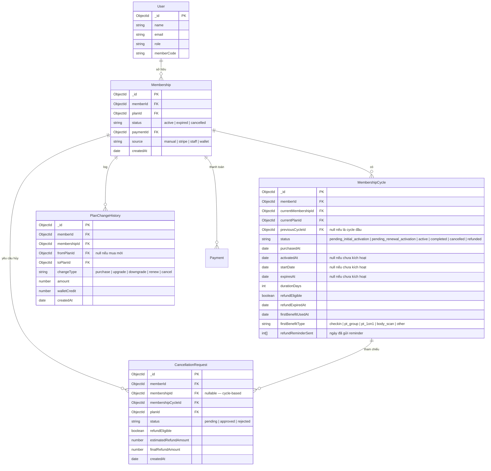
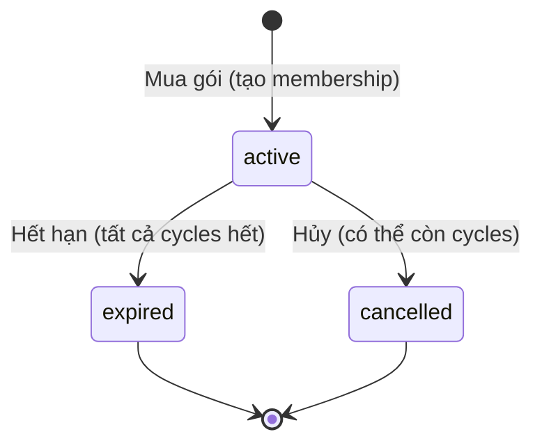
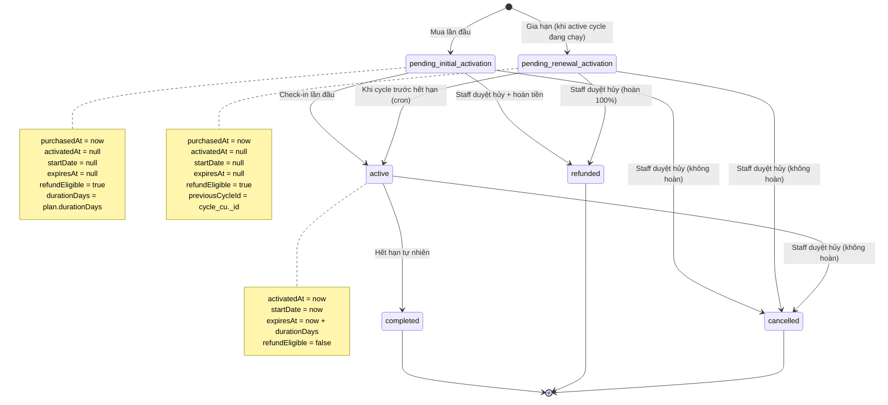
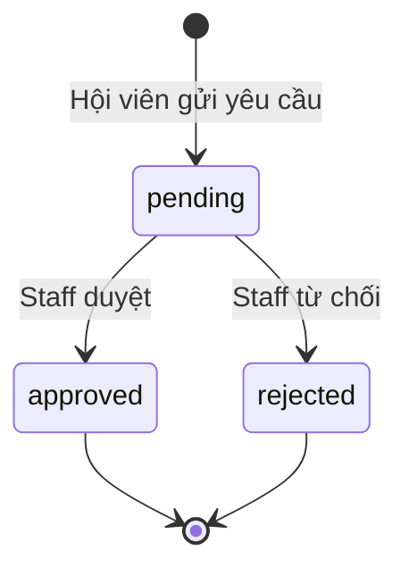
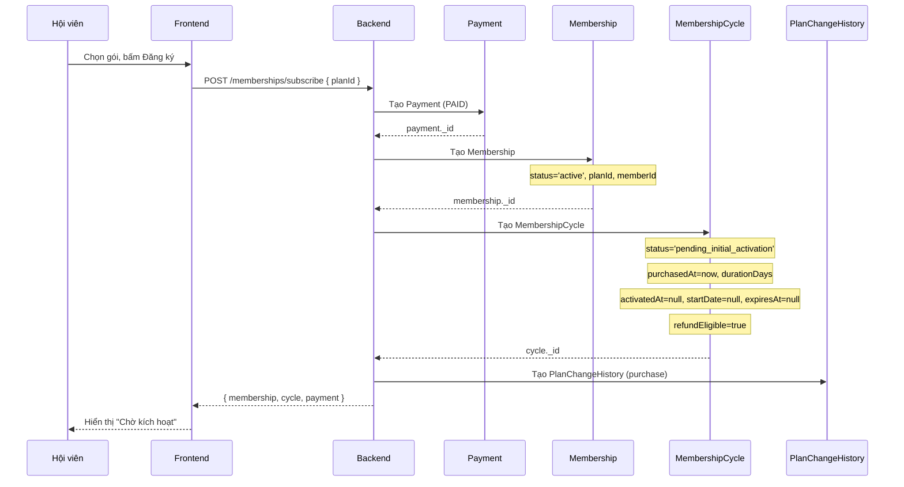
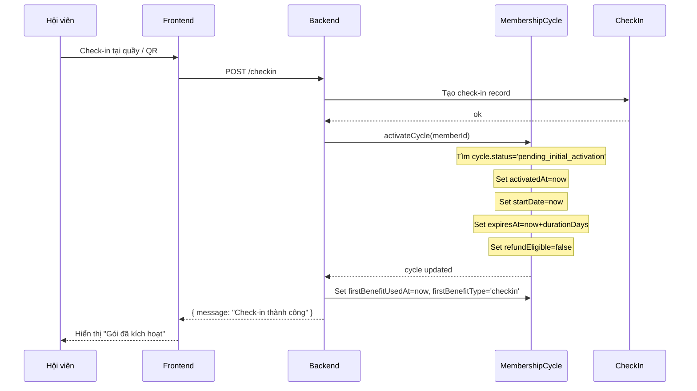
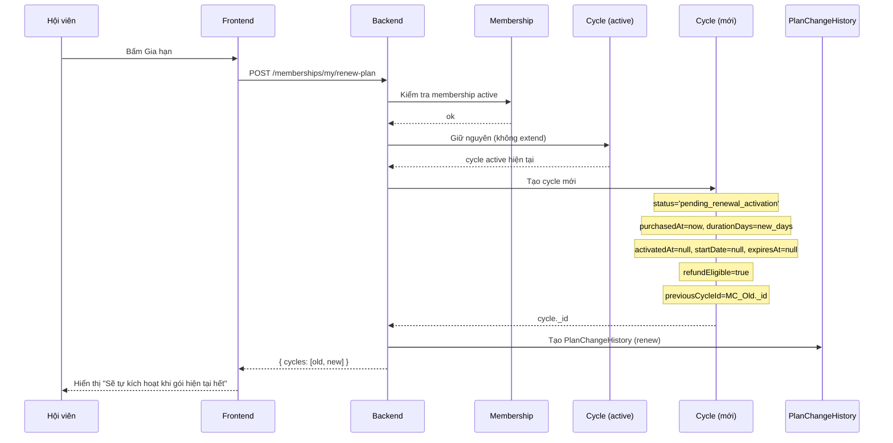
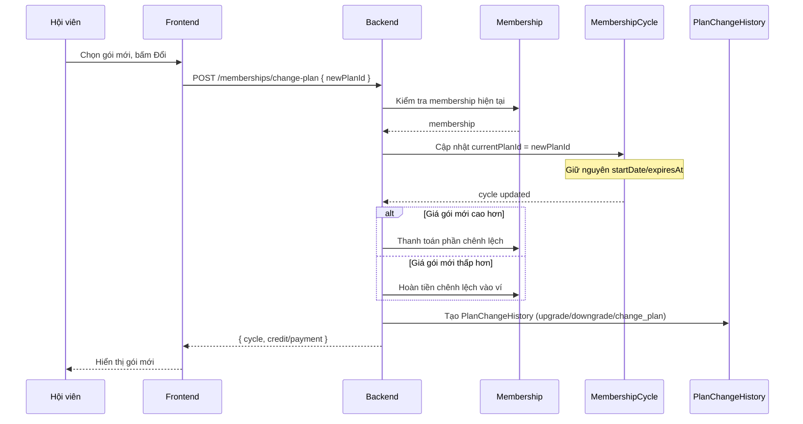
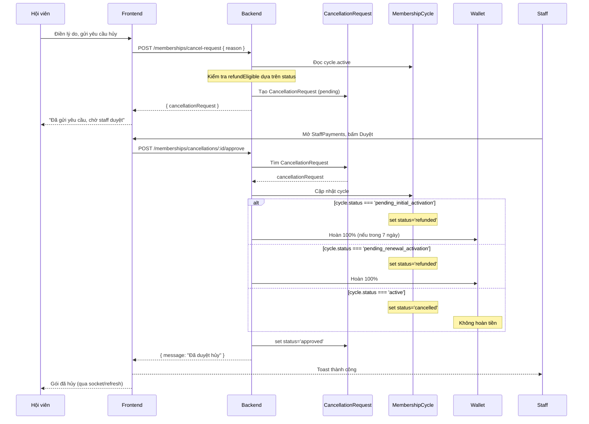
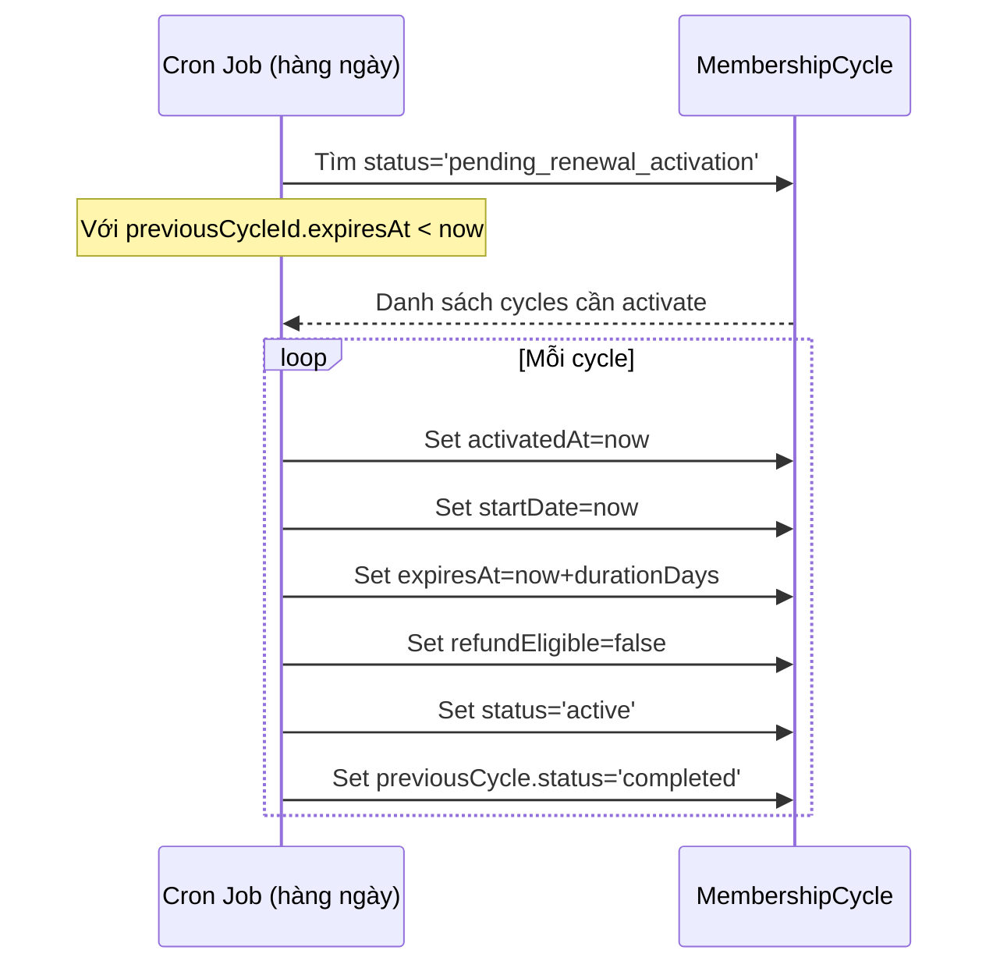

# Membership System Architecture

> **Design Mode** — Tài liệu này mô tả kiến trúc mục tiêu, chưa phải trạng thái hiện tại của code.
> Mọi thay đổi về model, controller, frontend sẽ được thực hiện theo tài liệu này sau khi được chốt.

---

## 1. Mục tiêu hệ thống

### Các model chính

| Model | Vai trò |
|-------|---------|
| **Membership** | **Container** — xác định hội viên đang sở hữu gì. Chỉ lưu memberId, planId, payment và trạng thái tổng quát (active / expired / cancelled). **Không lưu thời gian.** |
| **MembershipCycle** | **Nguồn sự thật duy nhất** — quyết định gói đang ở trạng thái nào, thời gian nào, có được hoàn tiền không, đã kích hoạt chưa. Một Membership có thể có nhiều Cycle (khi gia hạn tạo cycle mới). |
| **CancellationRequest** | Lưu yêu cầu hủy của hội viên. Khi staff duyệt, ảnh hưởng đến MembershipCycle (set status = refunded/cancelled). |
| **PlanChangeHistory** | Ghi log mỗi lần hội viên thay đổi gói (mua mới, gia hạn, nâng cấp, hạ cấp, hủy). Chỉ đọc, không ảnh hưởng đến logic. |

### Quan hệ giữa các model

```
Member (User)
  │
  ├── 1 ── N ──► Membership          (một member có thể có nhiều membership theo thời gian)
  │                │
  │                ├── 1 ── N ──► MembershipCycle    (một membership = nhiều cycle khi gia hạn)
  │                │
  │                ├── 1 ── N ──► PlanChangeHistory  (log thay đổi)
  │                │
  │                └── 1 ── N ──► CancellationRequest (yêu cầu hủy)
  │
  ├── 1 ── N ──► Payment            (thanh toán)
  │
  └── 1 ── N ──► MembershipPeriod   (sẽ được thay thế bởi cycle — legacy)
```

### Nguyên tắc thiết kế

1. **Một Membership = một lần đăng ký.** Nếu member hết hạn rồi đăng ký lại, tạo Membership mới.
2. **Một Membership có thể có nhiều MembershipCycle.** Cycle đầu là lần mua đầu, cycle sau là gia hạn.
3. **MembershipCycle quyết định tất cả:** thời gian bắt đầu, thời gian kết thúc, trạng thái kích hoạt, quyền hoàn tiền.
4. **Membership không lưu startDate, endDate, activatedAt.** Các thông tin này chỉ có ở Cycle.
5. **Mỗi cycle có thể bị hủy độc lập.** Hủy cycle gia hạn không ảnh hưởng cycle gốc.

---

## 2. Entity Relationship Diagram (ERD)



---

## 3. State Machine

### Membership (Container)



### MembershipCycle



### CancellationRequest



---

## 4. Sequence Diagram

### A. Mua gói (thanh toán wallet)



### B. Check-in lần đầu



### C. Gia hạn (khi đang active)



### D. Đổi gói (khi đang active)



### E. Hủy gói (Hội viên gửi yêu cầu + Staff duyệt)



### F. Tự động kích hoạt cycle gia hạn (Cron)



---

## 5. Single Source of Truth

Bảng dưới đây xác định **MỘT nơi duy nhất** cho mỗi thông tin.

### MembershipCycle — SỞ HỮU

| Thông tin | Model sở hữu | Controller được phép sửa |
|-----------|-------------|-------------------------|
| `startDate` | **MembershipCycle** | `membershipCycleService.activateCycle`, cron auto-activate |
| `expiresAt` (endDate) | **MembershipCycle** | `membershipCycleService.activateCycle`, cron auto-activate |
| `activatedAt` | **MembershipCycle** | `membershipCycleService.activateCycle`, cron auto-activate |
| `refundEligible` | **MembershipCycle** | `membershipCycleService.activateCycle` (set false), `refundReminderJob` (set false), `cancellationController.createCancellationRequest` (check) |
| `refundExpiredAt` | **MembershipCycle** | `refundReminderJob` |
| `purchasedAt` | **MembershipCycle** | `membershipService.subscribeWithWallet`, `membershipService.createActivatedMembership` |
| `durationDays` | **MembershipCycle** | `membershipService.subscribeWithWallet`, `membershipService.createActivatedMembership`, `membershipCycleService.activateCycle` |
| `status` | **MembershipCycle** | `membershipService` (khi tạo), `membershipCycleService.activateCycle`, `cancellationController` (khi duyệt), cron auto-activate |
| `firstBenefitUsedAt` | **MembershipCycle** | `membershipCycleService.activateCycle`, `membershipCycleService.markBenefitUsed` |
| `firstBenefitType` | **MembershipCycle** | `membershipCycleService.activateCycle`, `membershipCycleService.markBenefitUsed` |
| `currentMembershipId` | **MembershipCycle** | `membershipService` |
| `currentPlanId` | **MembershipCycle** | `membershipService`, `planChangeController` |
| `previousCycleId` | **MembershipCycle** | `membershipService` (khi tạo cycle gia hạn) |
| `refundReminderSent` | **MembershipCycle** | `refundReminderJob` |

### Membership — CHỈ CONTAINER

| Thông tin | Model sở hữu | Controller được phép sửa |
|-----------|-------------|-------------------------|
| `memberId` | **Membership** | `membershipService` (khi tạo) |
| `planId` | **Membership** | `membershipService`, `planChangeController` |
| `paymentId` | **Membership** | `membershipService`, `memberController` |
| `source` | **Membership** | `membershipService`, `memberController` |
| `status` | **Membership** | `membershipService` (khi tạo), `membershipService.lazyActivatePendingPeriods` (khi tất cả cycles completed → expired) |
| `createdAt` | **Membership** | Tự động (mongoose timestamp) |

> ⚠️ **Membership KHÔNG lưu:** `startDate`, `endDate`, `activatedAt`, `cancelledAt`, `cancelReason`, `cancelHandledBy`, `cancelHandledAt`
>
> Các thông tin này chỉ có ở MembershipCycle.

### CancellationRequest

| Thông tin | Model sở hữu | Controller được phép sửa |
|-----------|-------------|-------------------------|
| `status` | **CancellationRequest** | `cancellationController` (set approved/rejected) |
| `refundEligible` | **CancellationRequest** | `cancellationController.createCancellationRequest` (snapshot) |
| `estimatedRefundAmount` | **CancellationRequest** | `cancellationController.createCancellationRequest` |
| `finalRefundAmount` | **CancellationRequest** | `cancellationController.approveCancellationRequest` |

---

## 6. Controller Responsibility

### Backend Controllers / Services

| Controller/Service | Đọc model nào | Ghi model nào | Ghi chú |
|---|---|---|---|
| **membershipService** | Membership ✅, MembershipCycle ✅, Plan ✅, Payment ✅, Wallet ✅, Transaction ✅ | Membership ✅, MembershipCycle ✅, Payment ✅, PlanChangeHistory ✅, Wallet ✅, Transaction ✅ | Lõi — xử lý mua, gia hạn, kích hoạt |
| **membershipCycleService** | MembershipCycle ✅ | MembershipCycle ✅ | activateCycle, markBenefitUsed |
| **cancellationController** | Membership ✅, MembershipCycle ✅, CancellationRequest ✅ | Membership ✅ (cần chuyển sang chỉ ghi Cycle), MembershipCycle ✅, CancellationRequest ✅, Wallet ✅, Transaction ✅, PTAssignment ✅, ClassEnrollment ✅ | Hủy gói |
| **refundRequestService** | MembershipPeriod ✅, Membership ✅, RefundRequest ✅, MembershipCycle ✅ (chỉ đọc) | MembershipPeriod ✅, Membership ✅, RefundRequest ✅, Wallet ✅, Transaction ✅ | Period-based — sẽ thay thế bằng cycle-based |
| **planChangeController** | Membership ✅, MembershipCycle ✅, Plan ✅ | Membership ✅, MembershipCycle ✅, PlanChangeHistory ✅ | Đổi gói |
| **dailyQRCodeController** | MembershipCycle ✅ | MembershipCycle ✅, CheckIn ✅ | activateCycle khi check-in |
| **checkInController** | Membership ✅ | CheckIn ✅ | Staff check-in (cần chuyển sang dùng Cycle) |
| **bookingController** | Membership ✅ | ❌ | Kiểm tra active membership (cần chuyển sang Cycle) |
| **planController** | Membership ✅ (countDocuments) | ❌ | Thống kê |
| **memberController** | Membership ✅ | Membership ✅ | Staff tạo member, membership |
| **authController** | Membership ✅ | ❌ | Kiểm tra membership khi login |
| **featureCheck** | Membership ✅ | ❌ | Kiểm tra plan features |
| **membershipReminderScheduler** | Membership ✅ | Membership ✅ (remindersSent) | Nhắc hết hạn |
| **refundReminderJob** | MembershipCycle ✅ | MembershipCycle ✅ | Hết quyền hoàn tiền sau 7 ngày |

### Frontend Pages / Components

| Page | Đọc model nào | Ghi chú |
|------|-------------|---------|
| **MyMembershipPage** | Membership (status, plan) ✅, MembershipCycle (status, activatedAt, expiresAt, refundEligible, purchasedAt) ✅ | Cần chuyển sang dùng Cycle làm nguồn chính |
| **CancelMembershipPage** | CancelInfo (bao gồm cycle data) ✅ | Đã cycle-based |
| **StaffPaymentsPage** | RefundRequest + CancellationRequest (merged) ✅ | Cần update status labels |
| **WorkoutPage** | Membership (status) ✅ | Cần chuyển sang Cycle |

---

## 7. Business Rules

### 7.1. Mua mới

| Rule | Mô tả |
|------|-------|
| **R1** | Khi thanh toán thành công, tạo Membership (status='active') và MembershipCycle (status='pending_initial_activation'). |
| **R2** | Cycle mới có `purchasedAt=now`, `durationDays=plan.durationDays`, `activatedAt=null`, `startDate=null`, `expiresAt=null`. |
| **R3** | Cycle mới có `refundEligible=true` (từ ngày mua đến hết 7 ngày sau). |
| **R4** | Membership KHÔNG set `startDate`/`endDate`. Thời gian chỉ tính từ Cycle. |

### 7.2. Kích hoạt

| Rule | Mô tả |
|------|-------|
| **R5** | Chỉ check-in lần đầu mới kích hoạt cycle. Các benefit khác (PT, body scan) cũng có thể kích hoạt. |
| **R6** | Khi kích hoạt: `activatedAt=now`, `startDate=now`, `expiresAt=now+durationDays`, `refundEligible=false`, `status='active'`. |
| **R7** | Nếu cycle đã `active` rồi (activatedAt != null), các check-in sau không ảnh hưởng. |

### 7.3. Hoàn tiền

| Rule | Mô tả |
|------|-------|
| **R8** | Cycle `pending_initial_activation` có thể hoàn 100% nếu `purchasedAt` trong vòng 7 ngày. |
| **R9** | Cycle `pending_renewal_activation` luôn có thể hoàn 100% (chưa kích hoạt, chưa dùng). |
| **R10** | Cycle `active` KHÔNG được hoàn tiền (đã kích hoạt). |
| **R11** | Sau 7 ngày kể từ `purchasedAt` mà chưa kích hoạt, `refundEligible` tự động set `false` (bởi cron job). |
| **R12** | Quyền hoàn tiền được snapshot tại thời điểm tạo CancellationRequest, không thay đổi sau đó. |

### 7.4. Gia hạn

| Rule | Mô tả |
|------|-------|
| **R13** | Khi gia hạn, tạo MembershipCycle MỚI với `status='pending_renewal_activation'`, `previousCycleId=cycle_cũ._id`. |
| **R14** | Cycle cũ KHÔNG bị thay đổi. Không extend durationDays, không extend endDate. |
| **R15** | Cycle gia hạn tự động kích hoạt khi cycle trước hết hạn (cron job chạy hàng ngày). |
| **R16** | Gia hạn KHÔNG cần check-in. Khi cycle cũ `completed`, cycle mới tự `active`. |
| **R17** | Hội viên có thể hủy cycle `pending_renewal_activation` để được hoàn 100%. |

### 7.5. Đổi gói

| Rule | Mô tả |
|------|-------|
| **R18** | Khi đổi gói, chỉ cập nhật `currentPlanId` trên cycle hiện tại. |
| **R19** | Thời gian startDate/expiresAt không thay đổi. |
| **R20** | Nếu gói mới giá cao hơn: thu phần chênh lệch. Nếu thấp hơn: hoàn chênh lệch vào ví. |

### 7.6. Hủy gói

| Rule | Mô tả |
|------|-------|
| **R21** | Hội viên có thể yêu cầu hủy bất kỳ cycle nào (pending_initial, pending_renewal, active). |
| **R22** | Mỗi cycle có một CancellationRequest riêng. |
| **R23** | Staff duyệt = cycle bị ảnh hưởng. Các cycle khác (nếu có) không bị ảnh hưởng. |
| **R24** | Khi duyệt: set `cycle.status='refunded'` (nếu có hoàn) hoặc `'cancelled'` (nếu không). |
| **R25** | Nếu `pending_initial_activation`: hoàn 100% nếu trong 7 ngày. |
| **R26** | Nếu `pending_renewal_activation`: hoàn 100% (chưa kích hoạt). |
| **R27** | Nếu `active`: KHÔNG hoàn (đã kích hoạt). |

### 7.7. Hiển thị Frontend

| Rule | Mô tả |
|------|-------|
| **R28** | MyMembershipPage render dựa trên `cycle.status`, không dựa trên `membership.status`. |
| **R29** | Nếu cycle `pending_initial_activation`: hiển thị "Chờ kích hoạt — hãy check-in lần đầu". |
| **R30** | Nếu cycle `pending_renewal_activation`: hiển thị "Sẽ tự động kích hoạt khi gói hiện tại hết". |
| **R31** | Nếu cycle `active`: hiển thị thông tin gói đang dùng (startDate → expiresAt). |
| **R32** | Nếu cycle `completed`: hiển thị "Gói đã hết hạn". |
| **R33** | Nếu cycle `cancelled`: hiển thị "Gói đã hủy" — empty state, không render card. |
| **R34** | Nếu cycle `refunded`: hiển thị "Đã hoàn tiền" — empty state, kèm thông tin hoàn. |

---

## 8. Edge Cases

| # | Tình huống | Xử lý |
|---|-----------|--------|
| **EC1** | Mua gói → chưa check-in → quá 7 ngày | Cycle vẫn `pending_initial_activation`. `refundEligible=false` (cron set). Vẫn chờ check-in để active. Sau khi active, time bắt đầu từ lúc check-in. |
| **EC2** | Gia hạn → cycle mới `pending_renewal_activation` → cycle cũ chưa hết nhưng member hủy | Hủy cycle mới (refunded). Cycle cũ không ảnh hưởng. |
| **EC3** | Đổi gói → rồi hủy | Hủy cycle hiện tại. PlanChangeHistory ghi log đổi gói rồi log hủy. |
| **EC4** | Hủy `pending_initial_activation` → quá 7 ngày | Không hoàn tiền (refundEligible=false). Cycle set cancelled. |
| **EC5** | Staff từ chối yêu cầu hủy | Cycle giữ nguyên trạng thái. Membership giữ nguyên. |
| **EC6** | Thanh toán lỗi (mua gói) | Không tạo Membership, không tạo Cycle. Payment status = FAILED. |
| **EC7** | Thanh toán lỗi (gia hạn) | Không tạo Cycle mới. Payment status = FAILED. Cycle cũ vẫn active. |
| **EC8** | Check-in trùng (cùng ngày) | Chỉ lần đầu activate cycle. Các lần sau chỉ tạo check-in record, không ảnh hưởng cycle. |
| **EC9** | Gia hạn nhiều lần (3+ cycles pending) | Mỗi lần tạo cycle `pending_renewal_activation` với `previousCycleId` trỏ về cycle trước đó. Cron kích hoạt lần lượt. |
| **EC10** | Gia hạn khi chưa kích hoạt (cycle đang `pending_initial_activation`) | Extend durationDays trên cycle hiện tại. Không tạo cycle mới. |
| **EC11** | Member có 2 Memberships (hết hạn rồi mua lại) | Mỗi Membership độc lập. Chỉ active membership được dùng. Cycles của membership cũ đều completed. |
| **EC12** | Staff tạo membership (offline) | Giống flow mua mới: tạo Membership + Cycle `pending_initial_activation`. Staff check-in = activate. |

---

## 9. File Impact

Danh sách tất cả file sẽ phải sửa (dự kiến).

### Phase 1 — Model
| File | Sửa |
|------|-----|
| `gym-backend/src/models/MembershipCycle.js` | Thêm enum: `pending_initial_activation`, `pending_renewal_activation`, `refunded`; bỏ `pending` |
| `gym-backend/src/models/Membership.js` | Bỏ enum: `pending_cancel`, `cancel_requested`, `refunded`; bỏ fields: `cancelledAt`, `cancelReason`, `cancelHandledBy`, `cancelHandledAt` |
| `gym-backend/src/models/MembershipPeriod.js` | Không sửa (legacy, vẫn dùng cho tính năng period-based cũ) |

### Phase 2 — Backend Services (lõi)
| File | Sửa |
|------|-----|
| `gym-backend/src/services/membershipService.js` | subscribeWithWallet: tạo cycle `pending_initial_activation`, gia hạn tạo cycle riêng `pending_renewal_activation`. getMyMembership: dùng cycle làm nguồn chính. getCancelInfo: dùng cycle.status. |
| `gym-backend/src/services/membershipCycleService.js` | activateCycle: tìm `pending_initial_activation`. Thêm `activatePendingRenewalCycles()`. |
| `gym-backend/src/services/refundRequestService.js` | approveRefundRequest: ghi cycle.status. |

### Phase 3 — Backend Controllers
| File | Sửa |
|------|-----|
| `gym-backend/src/controllers/cancellationController.js` | create: check cycle.status. approve: set cycle.status='refunded' hoặc 'cancelled'. Bỏ set membership.status. |
| `gym-backend/src/controllers/dailyQRCodeController.js` | activateCycle đã đúng, chỉ cần update query trong service. |
| `gym-backend/src/controllers/checkInController.js` | Chuyển từ check Membership.status sang check MembershipCycle.status. |
| `gym-backend/src/controllers/bookingController.js` | Chuyển từ check Membership.status sang check MembershipCycle.status. |
| `gym-backend/src/controllers/planChangeController.js` | Cập nhật currentPlanId trên Cycle. |
| `gym-backend/src/controllers/memberController.js` | Khi staff tạo membership: tạo Cycle `pending_initial_activation`. |
| `gym-backend/src/controllers/membershipController.js` | Không cần sửa nhiều (đã gọi service functions). |

### Phase 4 — Jobs + Sockets
| File | Sửa |
|------|-----|
| `gym-backend/src/jobs/refundReminderJob.js` | Tìm cycle `pending_initial_activation` hoặc `pending_renewal_activation`. |
| `gym-backend/src/jobs/lazyActivatePendingRenewalJobs.js` | **File mới**: cron kích hoạt cycle `pending_renewal_activation` khi cycle trước hết. |
| `gym-backend/src/services/socketService.js` | `emitRefundRequestUpdate`: đếm cả CancellationRequest. Thêm emit cho approve/reject cancellation. |

### Phase 5 — Frontend Services
| File | Sửa |
|------|-----|
| `gym-frontend/src/services/membershipService.ts` | Cập nhật type definitions. |

### Phase 6 — Frontend Pages
| File | Sửa |
|------|-----|
| `gym-frontend/src/pages/dashboard/member/MyMembershipPage.tsx` | Render dựa trên cycle.status. Thêm case: pending_initial_activation, pending_renewal_activation, refunded. |
| `gym-frontend/src/pages/dashboard/member/CancelMembershipPage.tsx` | Cập nhật hiển thị refund info dựa trên cycle. |
| `gym-frontend/src/pages/dashboard/staff/StaffPaymentsPage.tsx` | Cập nhật status labels. |
| `gym-frontend/src/pages/dashboard/member/WorkoutPage.tsx` | Check cycle.status thay vì membership.status. |

### Phase 7 — Migration
| File | Mô tả |
|------|-------|
| `gym-backend/scripts/migrateCycleStatuses.js` | **File mới**: chuyển dữ liệu cycle cũ sang status mới. |
| `gym-backend/scripts/verifyCountFix.js` | Cập nhật nếu cần. |

---

## 10. Migration Plan

### Phase 1: Chuẩn bị (Dry-run)

**Mục tiêu:** Kiểm tra dữ liệu hiện tại, không sửa gì.

```
1. Viết script đếm:
   - Cycle.status='active', activatedAt=null → pending_initial_activation
   - Cycle.status='pending' → pending_renewal_activation
   - Cycle.status='active', activatedAt!=null → giữ active
   - Membership.status='pending_cancel' → active (chuyển xuống cycle)
   - Membership.status='cancel_requested' → active
   - Membership.status='refunded' → cancelled

2. Kiểm tra số lượng:
   - Tổng cycles
   - Tổng memberships
   - Có conflict nào không?
```

### Phase 2: Model

**Mục tiêu:** Sửa schema, chạy migration.

```
1. Sửa MembershipCycle.js: thêm enum values
2. Sửa Membership.js: bỏ enum values thừa
3. Chạy migration script: chuyển dữ liệu cũ
4. Kiểm tra: compile không lỗi
```

### Phase 3: Backend Core

**Mục tiêu:** Sửa membershipService và membershipCycleService.

```
1. membershipCycleService:
   - activateCycle: tìm pending_initial_activation
   - Thêm activatePendingRenewalCycles()
   - getActiveCycle: tìm status='active'

2. membershipService:
   - subscribeWithWallet: tạo cycle pending_initial_activation
   - Gia hạn: tạo cycle pending_renewal_activation riêng
   - getMyMembership: dùng cycle làm nguồn
   - getCancelInfo: dùng cycle.status

3. cancellationController:
   - createCancellationRequest: check cycle.status
   - approveCancellationRequest: set cycle.status, bỏ set membership.status
```

### Phase 4: Backend Controllers khác

**Mục tiêu:** Cập nhật các controller phụ.

```
1. bookingController: check cycle.status
2. checkInController: check cycle.status (staff check-in)
3. planChangeController: update cycle (không extend)
4. memberController: tạo cycle pending_initial_activation
5. refundReminderJob: tìm đúng status
6. Thêm cron: lazyActivatePendingRenewalCycles
```

### Phase 5: Socket

**Mục tiêu:** Cập nhật socket events.

```
1. emitRefundRequestUpdate: đếm cả CancellationRequest
2. Thêm emit trong approve/reject cancellation
3. (Tùy chọn) emit cho activate cycle, renew cycle
```

### Phase 6: Frontend

**Mục tiêu:** Cập nhật giao diện.

```
1. MyMembershipPage:
   - Render dựa trên cycle.status
   - Thêm case pending_initial_activation
   - Thêm case pending_renewal_activation
   - Thêm case refunded

2. CancelMembershipPage: cập nhật display

3. StaffPaymentsPage: cập nhật status labels

4. WorkoutPage: check cycle.status
```

### Phase 7: Test

**Mục tiêu:** Kiểm tra toàn bộ luồng.

```
1. Test mua mới → pending_initial_activation → check-in → active
2. Test check-in lần đầu → activatedAt=now, expiresAt=now+durationDays
3. Test gia hạn → pending_renewal_activation → cron → active
4. Test hủy pending_initial_activation (trong 7 ngày) → refunded + hoàn 100%
5. Test hủy pending_initial_activation (quá 7 ngày) → cancelled (không hoàn)
6. Test hủy pending_renewal_activation → refunded + hoàn 100%
7. Test hủy active → cancelled (không hoàn)
8. Test quá 7 ngày chưa check-in → refundEligible=false
9. Test đổi gói → currentPlanId thay đổi, expiresAt giữ nguyên
10. Test gia hạn khi chưa kích hoạt → extend durationDays
11. Test nhiều cycle pending → kích hoạt tuần tự
12. Test frontend: render đúng cho mọi trạng thái
```

---

> **Tài liệu này là nguồn duy nhất cho toàn bộ refactor Membership.**
> Mọi AI / developer sau này đều phải đọc tài liệu này trước khi sửa bất kỳ dòng code nào liên quan đến Membership, MembershipCycle, Cancellation, Refund.
